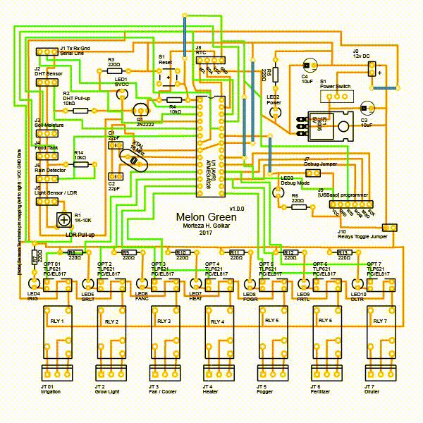

# Melon Green
## Make your custom 'Melon Green' Board

Melon Green is open source in terms of software and hardware. You can freely make your own board using Circuit Diagram and/or PCB Layout which are included in M.G.'s repo.  
Next step is to [Upload M.G.'s operating software to board's AVR](2_Upload_Melon_Green_to_AVR.md).

### Circuit Diagram and PCB Layout
Melon Green's Circuit Diagram, PCB Layout and some useful information about electronic parts can be found in [Melon Green v1.0.0.fzz](../Melon_Green_v1.0.0.fzz) file at repo's root. *There is also another version of board with external power for relays: [Melon Green v1.1.0.fzz](../Melon_Green_v1.1.0.fzz) in the same directory.*  
*`.fzz` project files are created by free and open source electronics CAD application, [Fritzing](http://fritzing.org).*

  

The Total Board has seven functions, but it's customizable.  
This one is a *simplified* version that I made to test and debug M.G.'s code:  

[Melon Green 1.0.0 SF](Melon_Green_1.0.0_SF.svg)

### Parts \[Shopping List]
**Total Board version**  

| Amount | Part Type | Description |
|:------:|-----------|----------|
| 1 | AVR (ATmega328) | ATMEL ATmega328/p (DIP) |
| 1 | Crystal | 16 MHz |  
| 2 | Capacitor | 22pF *Ceramic* |
| 2 | Capacitor Polarized | 10uF *Electrolytic* |
| 1 | Pushbutton | Tactile \[Reset] Button Switch (4 or 2 Legs) |
| 1 | Voltage Regulator | e.g. L7805, output voltage: 5V |
| 1 | SPST Switch | Power Switch (optional) |
| 3 | Male pin header: 1*2 pins | 1*6  ♂ male: 12v DC & Relays Ext Power (or Barrel Power Jack instead) & DebugMode Jumpers |
| 2 | Male pin header: 1*3 pins | 1*6  ♂ male: Internal/External Power for Relays Jumpers - if you want to use v1.1.0 |
| 6 | Female pin header: 3*1 pins | 1*18 ♀ female: Serial (Tx Rx Gnd) & Sensor Connectors |
| 1 | Female pin header: 4*1 pins | RTC Module Connector |
| 1 | Female pin header: 3*2 / 6 pins | \[USBasp] Programmer Connector |
| 7 | 3 Pins Screw terminal | For 7 Functions (Irrigation, Grow Light...) |
| 10 | Basic Color LED | Optional Colors (e.g. 1 Yellow, 1 Red & 8 Green) |
| 7 | Optocoupler | Optical Isolator like: TLP621 / PC817 / EL817 |
| 1 | TRANSISTOR_NPN | 2N2222 |
| 1 | TRIMPOT | 1-10 KΩ (LDR Variable Pull-Down Resistor) |
| 3 | 10kΩ Resistor | tolerance ±5%; 1/4 - 1 Watt |
| 10 | 220Ω Resistor | tolerance ±5%; 1/4 - 1 Watt |
| 7 | RELAY | For 7 Functions (12v SPDT) *for connecting High Voltage Equipments* |  

We need a base for the circuit. A prefboard, a printed board or even a cardboard may works for you. If you are not the Kung Fu Panda of wire-wrapping & soldering, it's recommended to make/order a printed board.
