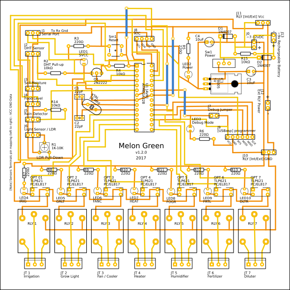
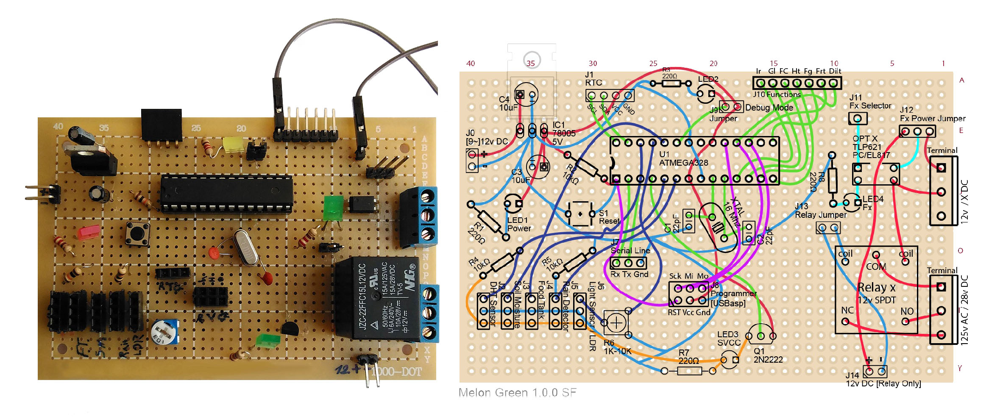

# Melon Green
## Make your custom Melon Green Board

Melon Green is open source in terms of software and hardware. You can freely make your own board using Circuit Diagram and/or PCB Layout which are included in M.G.'s repo.  
Next step is to [Upload M.G.'s operating software to board's AVR](2_Upload_Melon_Green_to_AVR.md).

### Circuit Diagram and PCB Layout
Melon Green's Circuit Diagram, PCB Layout and some useful information about electronic parts can be found in `Melon_Green_vx.x.x.fzz` files at the repo's root (last version) or *Board Revisions* folder.  
*`.fzz` project files are created by free and open source electronics CAD application, [Fritzing](http://fritzing.org).*   

  
Melon Green v1.2.0  

The board has seven functions (relays), but feel free to customize it. This one is a sample of simplified versions, made on a prefboard:  

### Parts \[Shopping List]
**Total Board (v1.2.0)**  

| Amount | Part Type | Description |
|:------:|-----------|----------|
| 1 | AVR (ATmega328) | ATMEL ATmega328/p (DIP) |
| 1 | Crystal | 16 MHz |  
| 2 | Capacitor | 22pF *Ceramic* |
| 2 | Capacitor Polarized | 10uF *Electrolytic* |
| 2 | Rectifier Diode | e.g. 1N4007 |
| 1 | Pushbutton | Tactile \[Reset] Button Switch (4 or 2 Legs) |
| 1 | Voltage Regulator | e.g. L7805, output voltage: 5V |
| 1 | SPST Switch | Power Switch |
| 3 | Male pin header: 1*2 pins | 1*6  ♂ male: DC power, Battery Connection, Relays Ext Power (or Power Jack) & DebugMode Jumper (or switch) |
| 2 | Male pin header: 1*3 pins | 1*6  ♂ male: Internal/External Power for Relays Jumpers |
| 6 | Socket or Pin Header: 3*1 pins | e.g. 1*18 ♀ female. for Serial (Tx Rx Gnd) port & Sensor Connectors |
| 1 | Pin Header: 4*1 pins | RTC Module Connector |
| 1 | Pin Header: 3*2 / 6 pins | \[USBasp] Programmer Connector |
| 7 | 3 Pins Screw terminal | For 7 Functions (Irrigation, Grow Light...) |
| 10 | Basic Color LED | Optional Colors (e.g. 2 Yellow, 1 Red & 7 Green) |
| 7 | Optocoupler | Optical Isolator like: TLP621 / PC817 / EL817 |
| 1 | TRANSISTOR_NPN | 2N2222 |
| 1 | TRIMPOT | 1-10 KΩ (LDR Variable Pull-Down Resistor) |
| 4 | 10kΩ Resistor | tolerance ±5%; 1/4 - 1 Watt |
| 10 | 220Ω Resistor | tolerance ±5%; 1/4 - 1 Watt |
| 7 | RELAY | For 7 Functions (12v SPDT) *for connecting High Voltage Equipments* |  
| 1 | 28 Pin DIP/ZIF Socket | (Optional) To place the AVR on the board safely |  
  
