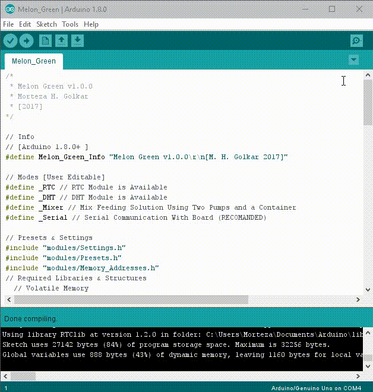
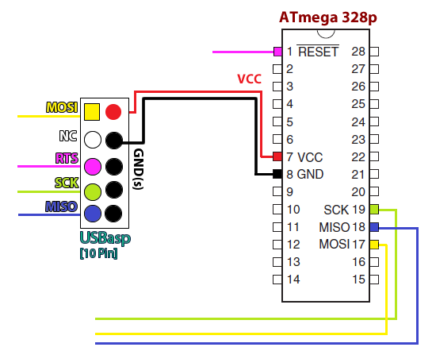
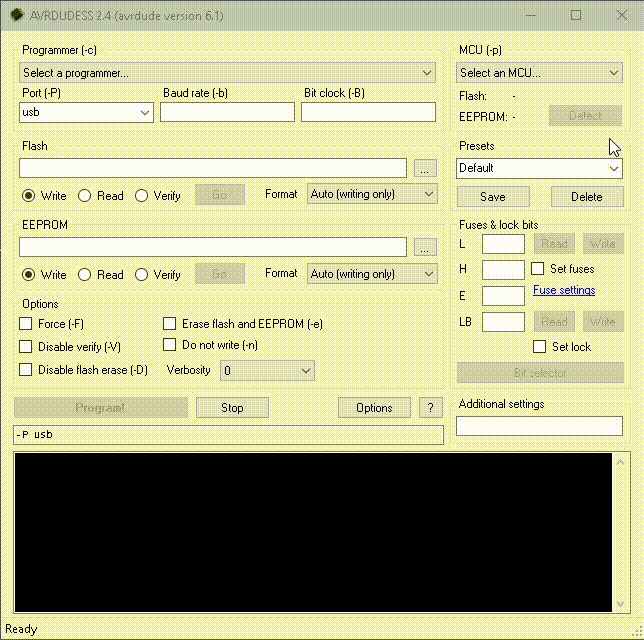

# Melon Green
## Setup *Melon Green* to board's AVR

### Step 1.
### Customize the Code
All the settings are accessible from [Serial Command Line Interface](3_Serial_Command_Line_Interface.md), except DHT (Humidity & Temperature) sensor type, RTC (Real Time Clock) module type, Duration of Manual Diagnostics & current Century. To change those settings please edit `Melon_Green\modules\Settings.h`.

```
 #define RTCMODULE RTC_DS3231
 #define DHTTYPE DHT11
 #define DiagMaxMilliSecond 30000 // (milliseconds)
 #define century 2000
```
These are possible values:  
*   Real Time Clock Module Types: RTC_DS3231, RTC_DS1307, RTC_PCF8523, RTC_PCF8563  
*   Humidity & Temperature Module: DHT22 (AM2302), DHT21, DHT11 (AM2301)  
If you like to use other sensors, take a look at `Melon_Green\Melon_Green.ino` under the 'Required Libraries & Structures'.

If you're not interested to use RTC, DHT or Feeding Solution Mixer, exclude appropriated *_indicator* from `Melon_Green\Melon_Green.ino`, right under `Modes \[User Editable]` comment line:

```
// Modes [User Editable]
 // #define _RTC // I2C RTC Module is NOT Available
 #define _DHT // DHT Module is Available
 #define _Mixer // Mix Feeding Solution Using Two Pumps and a Container
 #define _Serial // Serial Communication With Board (RECOMMENDED)
```
**Caution! Toggling `#define _RTC` *ON* and lack of RTC Module (I2C Slave) simultaneously, might freezes your board.**  

### Step 2.
### Compilation
Melon Green has developed under [Arduino/Wiring](https://en.wikipedia.org/wiki/Arduino#Software_development) platform.  
Please follow these steps to compile & upload M.G.'s operating software to AVR:
1. Download [Arduino IDE](https://www.arduino.cc/en/main/software) and set it up.
2. Download project repo & open the sketch file: `Melon_Green\Melon_Green.ino`.  
**\[Dependencies]**  
*You must have the following libraries installed: Adafruit's [DHT](https://github.com/adafruit/DHT-sensor-library), [RTClib](https://github.com/adafruit/RTClib) and PaulStoffregen's [Time library for Arduino](https://github.com/PaulStoffregen/Time). For more information please check this official article about [Installing Additional Arduino Libraries](https://www.arduino.cc/en/guide/libraries).*  
3. If you're using Arduino board (~UNO), skip to [2.3. Uploading to board (AVR) - Arduino Version](#arduino-version), otherwise...
4. Select the board type:  
`Menu-bar -> Tools -> Board... -> Arduino/Genuino Uno`.
5. Compile the code:  
`Menu-bar -> Sketch -> Export compiled Binary`.  

  

After a while, IDE's Status-bar says "Done compiling" & you have new `.hex` files in `\Melon_Green` directory, right by `.ino` file. All right. Now we are going to Upload it.


### Step 3.
### Uploading to board (AVR)
#### Arduino version
1.  Setup the [Arduino Environment (IDE)](https://www.arduino.cc/en/main/software).
2.  Install the USB drivers (if needed).
3.  Connect your board (via usb) to host.  
4.  Open `Melon_Green\Melon_Green.ino`.
5.  Select your board:  
`Menu-bar -> Tools -> Board... -> \[e.g.] Arduino/Genuino Uno`
6.  Select Communication port:  
`Menu-bar -> Tools -> Port -> COM#`
7.  Push the reset button on the board
8.  Click on the *Upload* button in the IDE (or `menu-bar -> Sketch -> Upload`).  
Wait a few seconds. If successful, the message "Done uploading" will appear.  

For more information take a look at: Arduino official [Howto](https://www.arduino.cc/en/main/howto) & [Troubleshooting](https://www.arduino.cc/en/guide/troubleshooting)

#### Standalone version
Standalone *M.G* needs more effort but I prefer it, because the result is more tidy.  
Requirements:
1. Standalone [Melon Green (DIY)](1_Melon_Green_Board_[DIY].md) on Perfboard, Breadboard or a PCB
2. Compiled [Binary '.hex' flash](#compilation) of Melon Green
3. AVR Programmer like **USBasp**, **AVRISP mkII**, etc
4. [AVRDUDE](http://www.nongnu.org/avrdude/) (& optional GUI)

##### Walk-through:  
**1. Setup your Programmer & Connect it to the AVR.**  
*E.g. USBasp with 10 pin wiring & ATmega328p (AVR) :*  
\+ *Win OS, requires a driver for USBasp: [Zadig (driver installation tool)](http://zadig.akeo.ie/) helps.*  
\+ Make sure that M.G's Jumpers is disconnected, to avoid unwanted flows.  

| pin | USBasp | ATmega328p | description |
|:---:|:--------:|:----------:|:-----------:|
| MOSI | 1 (1R) | 17 | Master Out Slave In |
| NC | 2R | -- | Not Connected |
| RST | 3R | 01 | Reset |
| SCK | 4R | 19 | Serial Clock |
| MISO | 5R | 18 | Master In Slave Out |
| Vcc | 2 (1L) | 07 | Power (5v/3v) |
| GND | 2L-5L | 08 | Common Ground |  

*Note: Double Check Your USBasp Pinout. Standard Color-coding says: Red Strip on normal ribbon cables is connected to pin 1 on the connector `(red strip > 1st up-right > MOSI)`.*  


**2. Write .hex flash to AVR using AVRDUDE**  
This is the AVRDUDE command:  
```
$ avrdude -c usbasp-clone -p m328p -P usb -e -U flash:w:"path/to/Melon_Green.ino.standard.hex":a
```
You may prefer to use a GUI as helping hand, like Zak Kemble's [AVRDUDESS](https://github.com/zkemble/AVRDUDESS). It's OK.
Open it plz. You'll see a form-like interface. Follow these steps:  
-   Select ``Any usbasp clone with correct VID/PID`` from ***Programmer (-c)*** drop-down list.  
-   Select `ATmega328p` from ***MCU (-p)*** drop-down list.  
-   Look for a fieldset called ***Fuses & lock bits*** (right, 3rd row). click on 1st `Read` button.  
-   If got `0xFF, 0xDE, 0x05` fuse bits, go ahead. The AVR is well connected & ready.  
-   From ***Flash*** field-set, browse compiled [Binary '.hex' flash](#compilation) of Melon Green. Select `Write` radio-button & `Auto...` from ***Format*** drop-down.  
-   Select `Erase flash and EEPROM (-e)` from ***Options***.  
-   click on **Program!** button and wait a moment.  
AVRDUDE writes the flash and verifies it.  



Fine.  
Happy Gardening!
