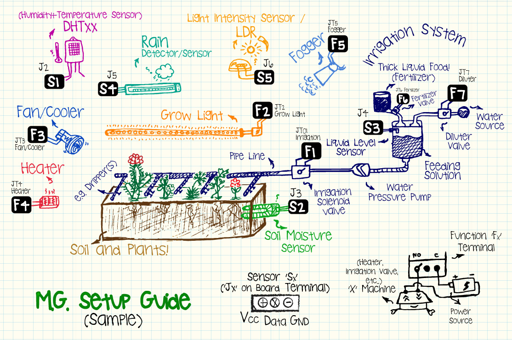
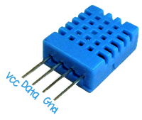
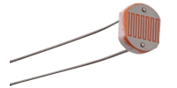
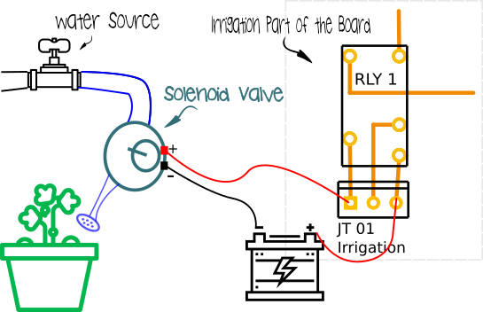
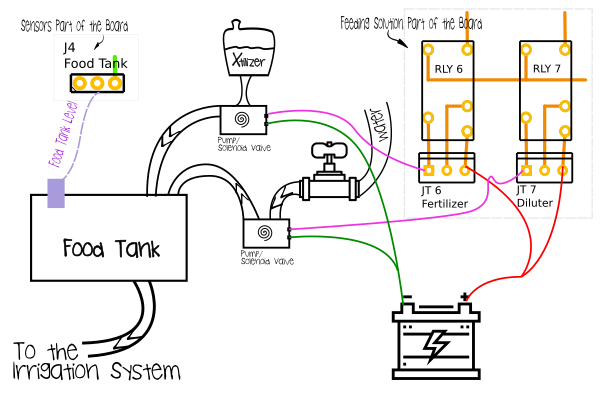

# Melon Green
## Setup Guide

Melon Green is a controller board which is useful to operate any electronically switchable (On/Off) agricultural facilities. You can put it through a variety of setups. This sample setup schematic, shows how to use most of M.G's potentials in a greenhouse:

  

### How to Power up the board
[Melon Green v1.0.0](../Melon_Green_v1.0.0.fzz) uses a common power path to relays and main electronic parts (including AVR Microcontroller through a 7805 regulator). Because an AVR can tolerate currents less than ~500mA (~50mA for IO pins), sometimes it's wise to separate power sources for relays. In such cases, please use newer versions which have some jumpers to switch between Int/Ext power source for relays.  
1. **J0** is the power source inlet. 7-12 V DC is OK. An AC to DC adapter is needed for normal house outlets. A Nine-volt heavy-duty battery works too.  
2. **J10 & J11** are jumpers which switch the Internal/External current to relays. J10 for negative terminal (Ground) and J11 for positive terminal (Vcc).  
*Note! Change both of them together.*
3. **J12** is the power inlet for the relays, if an external power source is available.  

### Connecting Sensors
*All sensors are optional.*  
*Each sensor helps M.G. to control actions (like Irrigation) based on the related Environmental Variables.* If you take a look at the board, you'll find *titled sensor terminals (like: J# - Sensor)* on the left side of the board. Each Sensor terminal has three pins: (from Left to right) `Vcc` \[~5v] `Gnd` \[Ground] & `Data`.  

**Note!**  
*1. Remember to [Customize Melon Green's Code](2. Upload the Melon Green to AVR.md) for the sensors being used.*   
*2. Calibrate Sensors via [Serial CLI](3. Serial Command Line Interface.md) for accurate results.*   

**Allowable Voltage/Current for each I/O pin is *~5v/45ma***   

#### J2. DHTxx
One of the most useful parts is a Digital Humidity & Temperature Sensor. DHTxx Family Sensors are cheap and handy. *M.G.* is compatible with DHT22 (AM2302), DHT21 (--Not Tested) & DHT11 (AM2301) by default.
You can *directly* connect DHTxx to Standalone MG because the board has built-in Pull-up resistor. No need for modules or breakouts.

  
Four legs are: Vcc (~5v), Data (i/o), Nc (Not connected) & Gnd (-).  

| DHTxx | Measurement Range | Humidity Accuracy | Temperature Accuracy | Sampling rate |
|:-:|:-:|:-:|:-:|:-:|
| DHT 11 | 20~90%RH & 0~50°C | 5% | 2° | 1Hz |
| DHT 22 | 0~100%RH & -40~125°C | 2~5% | 0.5° | 0.5Hz |

#### J3. Soil Moisture Sensor
Analog Soil Moisture Sensors generally sense the conductivity of the soil. As moist the soil is, less electrical resistance will be there.  

#### J4. Liquid Level Sensor (for Food Tank)
Feeding Solution Mixer (Please see below for details) is a useful experimental tool which helps user to mix water & thick liquid fertilizer in a third \[Food] tank. *If water is used directly (no fertilizer added, so no need for food mixing), you don't need this sensor*.  
*M.G.* uses an analog terminal to measure how much food is in the tank. Food level threshold calibration (Min & Max) is possible via *serial CLI*. Settings for fertilizer/water ratio and food tank volume are in *Feeding Solution* sub-menu.

#### J5. Rain Detector
Rain Detector which we use, is a simple digital on/off sensor. It passes ~5v from the *Vcc Pin* to the *Rain Data Pin* when it's rainy out there \[ ~ e.g. Rain Drops Make a Short Circuit ] or ~0v when it's sunny. DIY & don't worry about pull-down, it's built-in to prevent false senses.  
Commercial sensors are available out there as well.

#### J6. Light Intensity Sensor
You can use any Analog Light Intensity Sensor (*Less than 5v output*) or a [LDR (Photocell)](https://en.wikipedia.org/wiki/Photoresistor). If you would rather use LDR, connect each leg to one of the Vcc or Data pins (Normall LDRs are not polarized). The built-in variable pull-down resistor (trimpot - R1) is useful to change the LDR's sensitivity to darkness and/or lightness. Here is an interesting article about [Using a Photocell with pull-down by Lady Ada](https://learn.adafruit.com/photocells/using-a-photocell).  

  

### Functions
There are many Irrigation Systems or Growth Environments in the real word, like [Hydroponics](https://en.wikipedia.org/wiki/Hydroponics) or [Drip Irrigation](https://en.wikipedia.org/wiki/Drip_irrigation). Some of them need grow light supply and some have heaters or foggers/humidifiers. Melon Green is a controller, so you may use it in any system with customization.  
In fact, when it's time to turn solenoid valves open or water pumps on for irrigation (according to [settings](3_Serial_Command_Line_Interface.md)), or when it's time to turn heater on, AVR makes dedicated [SPDT](https://en.wikipedia.org/wiki/Relay#Pole_and_throw) relay HIGH/Active and relay connects COM (far right pole/leg/screw of the terminal) to NO (Normally Open - far left leg/throw of same terminal). The middle leg is NC (Normally Closed throw - It's connected when the relay is inactive.  

**e.g. Home Drip Irrigation System**  
For Example, this figure shows how to setup most simple *M.G.* powered drip irrigation in home:  
  

This setup probably uses time-based functionalities of your M.G.  

### Feeding Solution Mixer
Sometimes it's necessary to feed plants with mixed water and fertilizer (or other treatments like sanitizers) on a regular base. In such cases *M.G.* has an experimental functionality to dilute concentrated liquid (= Generally mixing two sources).

  
