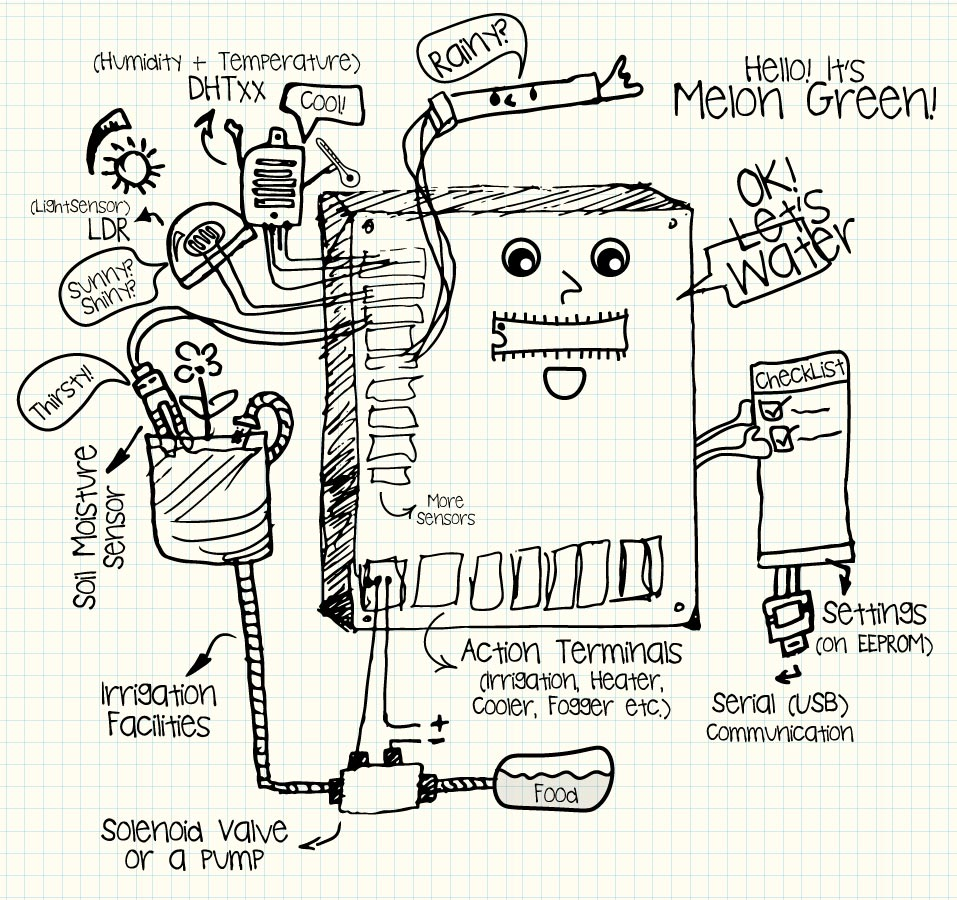

# Melon Green
### Greenhouse, Farm & Garden Automation Project
To assist plant lovers & hobby gardeners, as well as greenhouse or garden keepers, Melon Green project is an open-source farm, garden and greenhouse automation controller system (hardware & software), which is aimed to be easy to use, affordable and multipurpose.   

### How does it work?
In summary, Melon Green is a [board](Documentation/1_Melon_Green_Board_[DIY].md) (based on AVR microprocessors) with an [operating software](Documentation/2_Upload_Melon_Green_to_AVR.md), which gets [your orders (settings)](Documentation/3_Serial_Command_Line_Interface.md), detects events in its environment, and toggles agricultural machinery (like irrigation pumps, solenoid valves, heaters, humidifiers, etc.) on or off, whenever it's needed.  
Melon Green Keeps Date & Time, Senses Temperature, Humidity, Soil Moisture, Rain (Detection) & Room/Sun Light Intensity. It can operate irrigation system/facilities, grow light supplier, heater, fan/cooler and humidifier. Melon Green has also some experimental functionalities to mix feeding solution (e.g. diluting concentrated liquid fertilizer).  

### How-to & Instructions
For more information, please take a look at links below:
*   [Make your custom *Melon Green* board](Documentation/1_Melon_Green_Board_[DIY].md)
*   [Setup *Melon Green* operating software to board's AVR](Documentation/2_Upload_Melon_Green_to_AVR.md)
*   [Communicate with board & configure M.G.](Documentation/3_Serial_Command_Line_Interface.md)
*   [Sample Setup Guide](Documentation/4_Sample_Setup_Guide.md)

### Revision History
|Hardware|Software|Description|
|:------:|:------:|:----------|
|v1.0.0|v1.0.0|First Release|
|v1.1.0||+ Switchable Ext/Int Power Source for Relays|
|v1.2.0||+ Battery Power (Auto-Switch)|
||v1.1.0|✓ More Accurate Internal Clock|
|||✓ Some Bugs *Fixed* in Duty Cycle |
|||✓ Analog Sensors Noise Protection|
|||+ Irrigation per Day Limit
|||+ Night-time Humidity & Temperature Controller (Independent)|   
||v1.2.0|Fully Revised OS (Major Bug Fixes) + RTC is Now Required.|

Compiling Report (Approx.):  
> *ATmega328p \[~ Arduino Uno]*  
> Sketch uses 30134 bytes (93%) of program storage space. Maximum is 32256 bytes.  
> Global variables use 1101 bytes (53%) of dynamic memory, leaving 947 bytes for local variables. Maximum is 2048 bytes.

<!-- (  ) -->

*M. H. Golkar*  
*2017*
